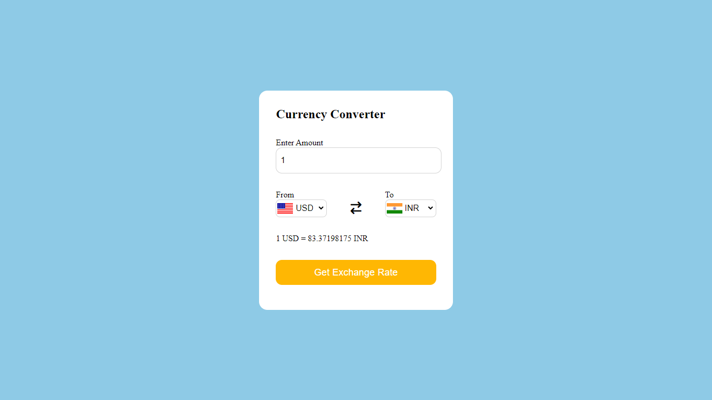

# Currency Converter

Welcome to the Currency Converter project! This web application allows users to convert between different currencies using real-time exchange rates from an external API. Built with HTML, CSS, and JavaScript, this project provides a convenient and user-friendly way to perform currency conversions.

# Features

Conversion between 159 currencies
Real-time exchange rates fetched using the Fetch API
User-friendly interface with easy input and output display

# Technologies Used

HTML
CSS
JavaScript

# How to Use

1. Open the Currency Converter in your web browser.
2. Enter the amount you want to convert.
3. Select the currency to convert from and to from the dropdown menus.
4. Click the "Get Exchange Rate" button to see the converted amount.

You can access the deployed version of the Currency Converter project [here](https://your-deployed-link.com).

# Visual Preview

# API Integration

The project uses the Fetch API to retrieve exchange rates from a currency exchange rate provider. No API key is required for accessing the exchange rates. The latest exchange rates are fetched directly from the provider's API endpoint.
The project uses the Flags API from flagsapi.com to generate flag images for different countries. This API provides high-quality flag images that are displayed alongside currency conversion results to enhance the user experience.
For more information on using the API, you can refer to the official GitHub repository of the currency exchange rate provider at [Currency Provider's GitHub Repository](https://github.com/fawazahmed0/currency-api?tab=readme-ov-file).

# Learning Experience

During the development of this project, I gained valuable experience in working with APIs, handling asynchronous JavaScript operations, and dynamically updating the DOM based on user input. I also improved my skills in front-end development, including HTML, CSS, and JavaScript.

# Author

Rishabh Rander
